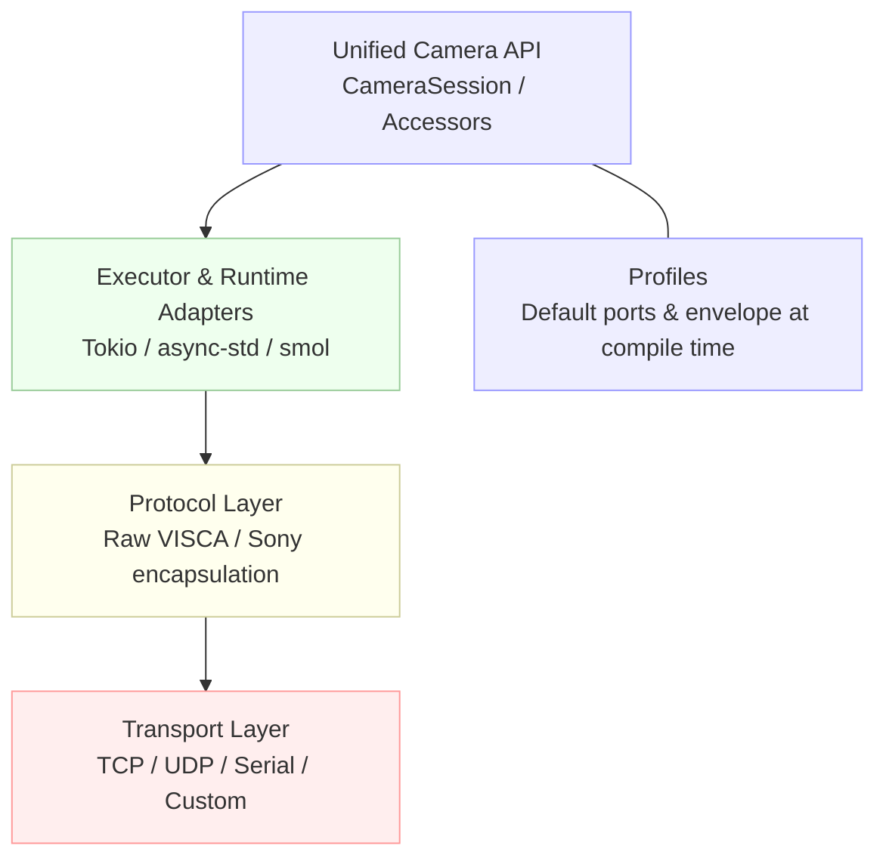

# grafton‑visca

[](https://crates.io/crates/grafton-visca)
[](https://docs.rs/grafton-visca)
[](LICENSE)
[](https://github.com/GrantSparks/grafton-visca/actions)

**Pure Rust VISCA control for PTZ cameras, with a unified blocking/async API and multi‑runtime support (Tokio, async‑std, smol).**
Designed for broadcasters/streamers and systems integrators who need production‑worthy control of VISCA compatible cameras over IP (and serial).

---

## Table of contents

* [Why this crate](#why-this-crate)
* [Installation](#installation)

  * [Feature flags](#feature-flags)
* [Quick Start](#quick-start)

  * [Blocking](#blocking)
  * [Async (Tokio), plus other runtimes](#async-tokio-plus-other-runtimes)
  * [Multi‑runtime coexistence](#multi-runtime-coexistence)
* [Usage Patterns](#usage-patterns)
* [Camera Profiles & Capabilities](#camera-profiles--capabilities)
* [API Design: Accessor Pattern](#api-design-accessor-pattern)
* [Timeouts & Error Handling](#timeouts--error-handling)
* [Transports & Protocols](#transports--protocols)
* [Concurrency & Thread Safety](#concurrency--thread-safety)
* [Architecture](#architecture)
* [Examples](#examples)
* [Testing](#testing)
* [Performance Notes](#performance-notes)
* [Troubleshooting / FAQ](#troubleshooting--faq)
* [Compatibility](#compatibility)
* [Contributing](#contributing)
* [License](#license)
* [Resources](#resources)

---

## Why this crate

* **Unified API:** One API surface works for both blocking and async (no separate “\*\_async” traits). Accessors like `camera.power().on()` compile in both modes; blocking returns `Result`, async returns a `Future<Output = Result>`.
* **Multi‑runtime async:** First‑class adapters for Tokio, async‑std, and smol. You pass a runtime handle to async open helpers/builders.
* **Type‑safe camera profiles:** Profiles carry protocol “envelope” choice (e.g., Sony encapsulation) and default ports at compile time.
* **Multiple transports:** TCP, UDP, and serial (blocking and async‑Tokio serial), plus BYO custom transport via traits.
* **Time‑tested API:** Builder and one‑liner `Connect::open_*` helpers; explicit `close()`; doc’d error/retry/timeout categories.
* **MSRV & clean gating:** Blocking is the default (no features). Async is opt‑in via feature flags; the public API surface changes accordingly. MSRV is 1.80.0.

---

## Installation

> **Default = blocking only** (no async deps). Enable a runtime to use async.

```toml
# Blocking only (default feature set = none)
[dependencies]
grafton-visca = "0.7"
````

```toml
# Async, runtime-agnostic core (enables async APIs; pick a runtime next)
[dependencies]
grafton-visca = { version = "0.7", features = ["mode-async"] }
```

```toml
# Async with a specific runtime (Tokio/async-std/smol)
[dependencies]
grafton-visca = { version = "0.7", features = ["runtime-tokio"] }
tokio = { version = "1", features = ["full"] }
# OR
grafton-visca = { version = "0.7", features = ["runtime-async-std"] }
async-std = { version = "1", features = ["attributes"] }
# OR
grafton-visca = { version = "0.7", features = ["runtime-smol"] }
smol = "1"
```

```toml
# Serial (blocking)
[dependencies]
grafton-visca = { version = "0.7", features = ["transport-serial"] }
```

```toml
# Serial (async, Tokio)
[dependencies]
grafton-visca = { version = "0.7", features = ["runtime-tokio", "transport-serial-tokio"] }
tokio = { version = "1", features = ["full"] }
```

All feature names above match the crate’s `Cargo.toml`. Defaults are empty; there is no implicit async.

### Feature flags

| Feature                  | Default? | Unlocks                            | Affects API? | Notes                                                                                                        |
| ------------------------ | -------: | ---------------------------------- | :----------: | ------------------------------------------------------------------------------------------------------------ |
| `mode-async`             |       No | Async stack and types              |    **Yes**   | Enables async camera/session APIs; used by all `runtime-*` features.                                         |
| `mode-blocking`          |      Yes | Feature detection only             |      No      | Blocking is available by default when `mode-async` is **not** enabled. |
| `runtime-tokio`          |       No | Tokio runtime adapter              |      No      | Implies `mode-async`. Provides `TokioRuntime` and async serial via `transport-serial-tokio`.                 |
| `runtime-async-std`      |       No | async‑std runtime adapter          |      No      | Implies `mode-async`. Provides `AsyncStdRuntime`.                                                            |
| `runtime-smol`           |       No | smol runtime adapter               |      No      | Implies `mode-async`. Provides `SmolRuntime`.                                                                |
| `transport-serial`       |       No | **Blocking** serial transport      |      No      | Uses `serialport` (blocking).                                                                                |
| `transport-serial-tokio` |       No | **Async (Tokio)** serial transport |      No      | Requires `runtime-tokio`; uses `tokio-serial`.                                                               |
| `test-utils`             |       No | Internal test helpers              |      No      | For the repo’s tests/dev only.                                                                               |

> **Canonicals:** Serial feature names are `transport-serial` (blocking) and `transport-serial-tokio` (async). Use these exact spellings.

---

## Quick Start

### Blocking

The **one‑liner** path uses the `Connect` helpers. Accessors are unified and **do not** require trait imports.

```rust
use grafton_visca::camera::{profiles::PtzOpticsG2, Connect};

fn main() -> Result<(), grafton_visca::Error> {
    let mut cam = Connect::open_tcp_blocking::<PtzOpticsG2>("192.168.0.110")?;
    cam.power().on()?;
    cam.zoom().tele()?;
    let pos = cam.pan_tilt().position()?; // inquiry
    println!("PT pos: {:?}", pos);
    cam.close()?; // explicit cleanup (optional; Drop also closes)
    Ok(())
}
```

* `Connect::open_tcp_blocking::<P>(addr)` returns a blocking client/session configured with the profile’s default protocol envelope.
* Accessors like `.power()` / `.zoom()` are available on the session; in blocking mode each call returns `Result`.

### Async (Tokio), plus other runtimes

Pick a runtime feature and pass its handle to `open_*_async`.

```rust
use grafton_visca::camera::{profiles::PtzOpticsG2, Connect};
use grafton_visca::runtime::TokioRuntime;

#[tokio::main]
async fn main() -> Result<(), grafton_visca::Error> {
    let rt = TokioRuntime::from_current()?;
    let cam = Connect::open_tcp_async::<PtzOpticsG2, _>("192.168.0.110", rt).await?;
    cam.power().on().await?;
    cam.zoom().tele().await?;
    cam.close().await?;
    Ok(())
}
```

* `Connect::open_tcp_async::<P, R>(addr, runtime)` is generic over profile and runtime. Use `TokioRuntime`, `AsyncStdRuntime`, or `SmolRuntime`.
* See `examples/quickstart_async.rs` for the same pattern under each runtime feature.

> **Serial (async)**: `Connect::open_serial_async::<P, _>(port, baud, runtime).await` (requires `transport-serial-tokio` and `runtime-tokio`).

---

## Usage Patterns

### 1) Simple / blessed path

* **Blocking:** `Connect::open_tcp_blocking::<Profile>(addr)` or `::open_udp_blocking(addr)`.
* **Async:** `Connect::open_tcp_async::<Profile, Runtime>(addr, runtime).await` or `::open_udp_async(addr, runtime).await`.

### 2) Advanced (BYO transport / builder knobs)

Build a transport, then open via the camera builder:

```rust
use grafton_visca::transport::Transport;
use grafton_visca::camera::{profiles::PtzOpticsG2, CameraBuilder};
use std::time::Duration;

// Blocking transport builder
let transport = Transport::tcp()
    .address("192.168.0.110:5678")
    .connect_timeout(Duration::from_secs(10))
    .tcp_nodelay(true)
    .build_blocking()?;

// Attach to a camera with a specific profile
let camera = CameraBuilder::from_transport_handle(transport)
    .profile::<PtzOpticsG2>()
    .open()?; // explicit connect
```

The builder exposes TCP/UDP selectors (`CameraBuilder::tcp/udp`), `profile::<P>()`, and `open()` / `open_async()` entry points.

> **Naming consistency:** This crate uses **`open_*`** (not `connect_*`) and **`close()`** (not `shutdown()`) on sessions/clients. Async `close()` is `await`‑able.

---

## Camera Profiles & Capabilities

Profiles embed default ports and protocol envelope selection:

| Profile        | Envelope           | Default TCP | Default UDP | Notable capabilities                                 |
| -------------- | ------------------ | ----------: | ----------: | ---------------------------------------------------- |
| `GenericVisca` | Raw VISCA          |        5678 |        1259 | Conservative baseline for VISCA cameras.             |
| `PtzOpticsG2`  | Raw VISCA          |        5678 |        1259 | PTZ, presets, exposure, WB, focus; **no ND filter**. |
| `PtzOpticsG3`  | Raw VISCA          |        5678 |        1259 | Expanded PTZOptics set; **no ND filter**.            |
| `PtzOptics30X` | Raw VISCA          |        5678 |        1259 | 30x optical zoom profile; **no ND filter**.          |
| `SonyFR7`      | Sony encapsulation |       52381 |       52381 | ND filter, direct menu, variable speed.              |
| `SonyBRCH900`  | Sony encapsulation |       52381 |       52381 | Sony professional profile (encapsulation).           |
| `SonyBRC300`   | Raw VISCA          |        5678 |        1259 | Legacy BRC‑300 behavior; raw VISCA.                  |
| `NearusBRC300` | Raw VISCA          |        5678 |        1259 | Nearus variant of BRC‑300 behavior.                  |
| `SonyEVIH100`  | Raw VISCA          |        5678 |        1259 | EVI‑H100 series; raw VISCA.                          |

> The envelope (raw vs Sony encapsulation) is compile‑time via the profile. You can override/detect at runtime with `CameraConfig` (see [Usage Patterns](#usage-patterns)).

**Control traits:** The public API exposes **20** control traits (accessed via accessors; no explicit trait imports required in normal use):

`PowerControl`, `ZoomControl`, `PanTiltControl`, `FocusControl`, `ExposureControl`, `WhiteBalanceControl`, `ColorControl`, `ImageProcessingControl`, `VariableSpeedControl`, `PresetsControl`, `InquiryControl`, `PanTiltInquiryControl`, `SystemControl`, `StreamingControl`, `TallyControl`, `NdFilterControl`, `MotionSyncControl`, `MenuControl`, `DirectMenuControl`, `ExposureCompensationControl`.

---

## API Design: Accessor Pattern

Use discoverable accessors—IDE autocomplete shows what your profile supports.

```rust
// Blocking
let power = cam.power().state()?;
let zoom  = cam.zoom().position()?;
cam.pan_tilt().home()?;
let version = cam.system().version()?;

// Async
let is_on  = cam.power().state().await?;
let _      = cam.zoom().tele().await?;
```

* Accessors exist on `CameraSession`/`Camera` and return objects that carry the mode/profile types; the trait impls live on those accessor types, so **no trait imports** are required for normal use.
* Methods are profile‑validated. E.g., `NdFilterControl` accessor compiles only for profiles that support ND filter (e.g., `SonyFR7`).

---

## Timeouts & Error Handling

### Timeout categories

Configure per‑category timeouts via `TimeoutConfig`:

```rust
use grafton_visca::camera::CameraBuilder;
use grafton_visca::timeout::TimeoutConfig;
use std::time::Duration;

let timeouts = TimeoutConfig::builder()
    .ack_timeout(Duration::from_millis(300))
    .quick_commands(Duration::from_secs(3))
    .movement_commands(Duration::from_secs(20))
    .preset_operations(Duration::from_secs(60))
    .build(); // names per current API
```

Attach to cameras via the builder (`timeout_config(...)`). Blocking uses `CameraBuilder::new()...build_blocking`, async uses `CameraBuilder::with_executor(...).open_async`.

### Retries & errors

Error values include helpers for recovery:

```rust
loop {
    match cam.zoom().absolute(grafton_visca::units::Normalized(0.5)) {
        Ok(_) => break,
        Err(e) if e.is_retryable() => {
            if let Some(delay) = e.suggested_retry_delay() {
                std::thread::sleep(delay);
            }
        }
        Err(e) => return Err(e),
    }
}
```

* `Error::is_retryable()` and `Error::suggested_retry_delay()` exist and are used in the repo’s tests.
* UDP connects are connectionless by design; timeouts can differ vs TCP. The builder exposes retry/backoff knobs at the transport layer.

---

## Transports & Protocols

**Transports:** TCP, UDP, Serial, and custom.

* **TCP/UDP (blocking):** `Connect::open_tcp_blocking`, `Connect::open_udp_blocking`, or via `CameraBuilder::tcp/udp(...).open()`.
* **TCP/UDP (async):** `Connect::open_tcp_async(..., runtime).await`, `Connect::open_udp_async(..., runtime).await`, or builder `.open_async(runtime)`.
* **Serial (blocking):** `CameraConfig::<P>::new().serial(port, baud).open_serial_blocking()`. (Enable `transport-serial`.)
* **Serial (async, Tokio):** `Connect::open_serial_async::<P, _>(port, baud, TokioRuntime).await`. (Enable `runtime-tokio` + `transport-serial-tokio`.)

**Protocol envelopes:** Profiles set the default—**Raw VISCA** vs **Sony encapsulation**—and you can request **auto‑detection** via `CameraConfig::<P>::auto_protocol()`.

---

## Concurrency & Thread Safety

* The async camera/session uses an executor handle and is designed for concurrent command futures (e.g., `tokio::join!` in examples). The Accessor pattern supports binding multiple accessors and awaiting concurrently.
* The blocking client performs synchronous I/O; use one per thread or guard concurrent calls. A `TransportBusy`/timeout error indicates overlapping use on the same transport. (See error variants in `error.rs`.)

---

## Architecture



* Accessors are implemented atop mode‑generic `Camera<M, P, Tr, Exec>`; the executor & transport are generic type params.
* Envelopes (raw/sony) are compile‑time via the **profile’s** associated `Envelope` type.

---

## Examples

All examples are in this repo and compile with the features listed.

**Basic**

| Example             | Path                           | Run with                                                                                                  |
| ------------------- | ------------------------------ | --------------------------------------------------------------------------------------------------------- |
| Blocking quickstart | `examples/quickstart.rs`       | `cargo run --example quickstart` (no features)                                                            |
| Async quickstart    | `examples/quickstart_async.rs` | `cargo run --example quickstart_async --features runtime-tokio` (or `runtime-async-std` / `runtime-smol`) |
| Presets (blocking)  | `examples/preset_demo.rs`      | `cargo run --example preset_demo`                                                                         |

**Advanced**

| Example                        | Path                                         | Features                                  |
| ------------------------------ | -------------------------------------------- | ----------------------------------------- |
| Transports overview            | `examples-advanced/transports.rs`            | (blocking)                                |
| Builder API (blocking)         | `examples-advanced/builder_api.rs`           | (blocking)                                |
| Error handling (Tokio)         | `examples-advanced/error_handling.rs`        | `runtime-tokio`                           |
| Runtime demo (Tokio accessors) | `examples/runtime_demo.rs`                   | `runtime-tokio`                           |
| Type‑safe commands             | `examples-advanced/type_safe_commands.rs`    | (blocking)                                |
| Runtime demo (low‑level)       | `examples-advanced/runtime_demo_lowlevel.rs` | `mode-async`, `runtime-tokio`             |
| Runtime‑agnostic patterns      | `examples/runtime_agnostic.rs`               | `mode-async`                              |
| Sony encapsulation             | `examples-advanced/sony_encapsulation.rs`    | `runtime-tokio`                           |
| Serial (async, Tokio)          | `examples/serial_async_demo.rs`              | `runtime-tokio`, `transport-serial-tokio` |

---

## Testing

Common invocations:

```bash
# Blocking API only (default)
cargo test

# Async (Tokio)
cargo test --features runtime-tokio

# Async (async-std)
cargo test --features runtime-async-std

# Async (smol)
cargo test --features runtime-smol

# Serial (blocking)
cargo test --features transport-serial

# Serial (async, Tokio)
cargo test --features "runtime-tokio,transport-serial-tokio"

# All examples compile checks (Tokio)
cargo run --example quickstart_async --features runtime-tokio -- --help
```

The repo includes dedicated tests to ensure the camera‑first API, connect helpers, and UDP semantics work as expected (e.g., UDP “connect” success even to non‑existent hosts).

> **Counts:** The crate defines **20 control traits** (listed above). The command surface is broad (pan/tilt/zoom, exposure, WB, focus, presets, menu, system, streaming, ND, tally, etc.), but because commands are defined across many modules and via macros, we intentionally **do not hard‑code a numeric command count** here; see `src/command/` for the authoritative list.

---

## Performance Notes

* **Zero‑cost futures:** Async transport uses RPITIT (`async fn` in traits with `impl Trait`) to avoid boxing.
* **Pre‑validated profiles & envelopes:** Compile‑time envelope selection and profile‑specific validation avoid runtime conditionals.
* **Configurable buffering & retries:** Transport builder exposes connect timeouts, `tcp_nodelay`, and retry/backoff; UDP special‑cases are covered in tests.

---

## Troubleshooting / FAQ

* **“This example requires blocking/async…”**
  Examples gate on features. The quickstart files print guidance if you run under the wrong mode.
* **`InvalidState("No executor configured")` (async)**
  Ensure you passed a runtime to the builder or used `Connect::open_*_async` with a runtime handle.
* **Camera busy / contention**
  Use `Error::is_retryable()` and `suggested_retry_delay()` to back off and retry. Avoid overlapping blocking calls on the same client.
* **UDP gotchas**
  “Connect” doesn’t validate remote reachability; timeouts are expected when no peer replies. Prefer TCP unless you need UDP semantics.
* **Wrong port**
  Use the profile defaults: PTZOptics/raw VISCA typically TCP **5678** / UDP **1259**; Sony encapsulation typically **52381**.
* **Serial addressing**
  Use `CameraConfig::<P>::serial(port, baud)` and the serial `open_*` helpers. For async serial you must be on Tokio.

> **Safety:** PTZ motion physically moves hardware. Ensure a safe operating area and clearances before issuing movement commands.

---

## Compatibility

* **MSRV:** Rust **1.80.0** (declared in `Cargo.toml`).
* **Operating systems:** The crate builds in blocking mode by default; async and serial support depend on the enabled features and their upstream crates. Repository CI ensures that the project builds on Linux, macOS, and Windows.

---

## Contributing

Contributions are welcome! Please see **CONTRIBUTING.md** for guidelines.

---

## License

Licensed under either of:

* **Apache License, Version 2.0** — `LICENSE-APACHE`
* **MIT License** — `LICENSE-MIT`

at your option.

Unless you explicitly state otherwise, any contribution intentionally submitted for inclusion in the work shall be dual‑licensed as above, without additional terms or conditions.

---

## Resources

* **API docs:** [https://docs.rs/grafton-visca](https://docs.rs/grafton-visca)
* **Examples:** `examples/` and `examples-advanced/` (see [Examples](#examples))
* **Issues:** GitHub issues for this repo
