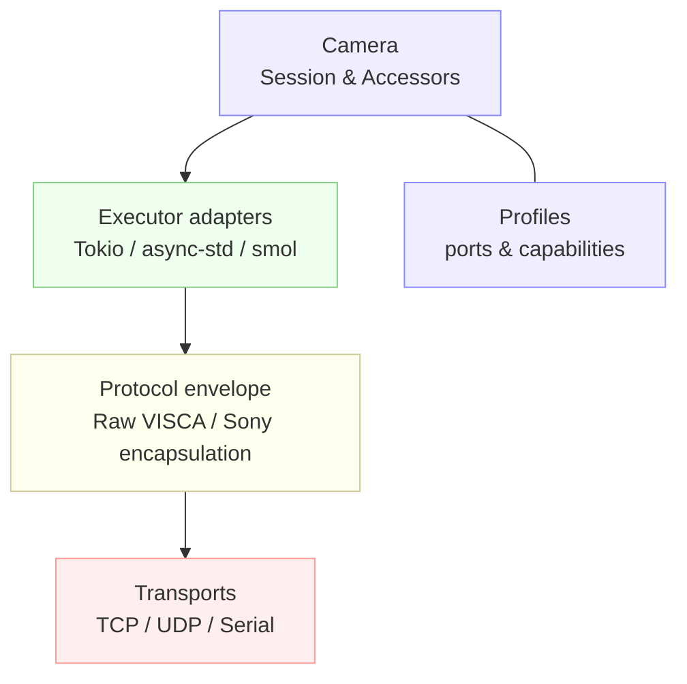

# grafton‑visca

[](https://crates.io/crates/grafton-visca)
[](https://docs.rs/grafton-visca)
[](LICENSE)
[](https://github.com/GrantSparks/grafton-visca/actions/workflows/ci.yml)

**Pure Rust VISCA control for PTZ cameras with a unified blocking/async API and multi‑runtime adapters (Tokio, async‑std, smol).**
For broadcasters/streamers, AV integrators, and Rust developers who need production‑grade, type‑safe VISCA control over IP or serial.

---

## Table of contents

* [Why this crate](#why-this-crate)
* [Installation](#installation)

  * [Feature flags](#feature-flags)
* [Quick Start](#quick-start)

  * [Blocking](#blocking)
  * [Async (Tokio); notes for async‑std/smol](#async-tokio-notes-for-async-stdsmol)
  * [Multi‑runtime coexistence](#multi-runtime-coexistence)
* [Usage Patterns](#usage-patterns)

  * [Simple / blessed path](#1-simple--blessed-path)
  * [Advanced (BYO transport / builder)](#2-advanced-byo-transport--builder)
* [Camera Profiles & Capabilities](#camera-profiles--capabilities)
* [API Design: Accessor Pattern](#api-design-accessor-pattern)
* [Timeouts & Error Handling](#timeouts--error-handling)
* [Transports & Protocols](#transports--protocols)
* [Concurrency & Thread Safety](#concurrency--thread-safety)
* [Architecture](#architecture)
* [Examples](#examples)
* [Testing](#testing)
* [Performance Notes](#performance-notes)
* [Troubleshooting / FAQ](#troubleshooting--faq)
* [Compatibility](#compatibility)
* [Contributing](#contributing)
* [License](#license)
* [Resources](#resources)

---

## Why this crate

* **Unified API (blocking and async):** A single `Camera<M, P, Tr, Exec>` type with mode‑generic accessors; futures are `Send` in async mode. The design is documented in `camera/mod.rs`.&#x20;
* **Multi‑runtime async:** Pluggable executors for Tokio, async‑std, and smol; you enable one or more runtime adapters via features and pass an executor to `open_*_async`. The runtime adapters live under `src/executor`, e.g. `TokioExecutor`.&#x20;
* **Type‑safe camera profiles:** Profiles compile in protocol envelope (Raw VISCA vs Sony encapsulation) and defaults (ports/behaviors). Accessors/controls are provided based on capabilities.&#x20;
* **Transports:** TCP/UDP (blocking and async) plus serial (blocking and async‑Tokio). Serial adds VISCA I/F Clear and Address Set orchestration in the transport.&#x20;
* **Ergonomics:** One‑line `Connect::open_*` helpers, a builder for advanced configuration, and a blocking wrapper with direct `Result` returns.&#x20;

---

## Installation

> **Default = blocking only.** Async is opt‑in by features.

**Blocking only (default):**

```toml
[dependencies]
grafton-visca = "0.7"
```

**Async core + runtime (Tokio shown):**

```toml
[dependencies]
grafton-visca = { version = "0.7", features = ["mode-async", "runtime-tokio"] }
tokio = { version = "1", features = ["full"] }
```

**Async with async‑std or smol:**

```toml
# async-std
grafton-visca = { version = "0.7", features = ["mode-async", "runtime-async-std"] }
async-std = { version = "1", features = ["attributes"] }

# smol
grafton-visca = { version = "0.7", features = ["mode-async", "runtime-smol"] }
smol = "1"
```

**Serial (blocking):**

```toml
grafton-visca = { version = "0.7", features = ["transport-serial"] }
```

**Serial (async, Tokio):**

```toml
grafton-visca = { version = "0.7", features = ["mode-async", "runtime-tokio", "transport-serial-tokio"] }
tokio = { version = "1", features = ["full"] }
```

Feature names and defaults are defined in `Cargo.toml` (`default = []`, `mode-async`, `runtime-*`, `transport-serial`, `transport-serial-tokio`, etc.).&#x20;

### Feature flags

| Feature                  | Default? | Unlocks                            | Affects API? | Notes                                          |
| ------------------------ | :------: | ---------------------------------- | :----------: | ---------------------------------------------- |
| `mode-async`             |    No    | Async mode, async camera/session   |    **Yes**   | Required by all `runtime-*` and async serial.  |
| `runtime-tokio`          |    No    | Tokio transport adapters/executor  |      No      | Implies `mode-async`.                          |
| `runtime-async-std`      |    No    | async‑std adapters/executor        |      No      | Implies `mode-async`.                          |
| `runtime-smol`           |    No    | smol adapters/executor             |      No      | Implies `mode-async`.                          |
| `transport-serial`       |    No    | **Blocking** serial transport      |      No      | RS‑232/422; I/F Clear & Address Set options.   |
| `transport-serial-tokio` |    No    | **Async (Tokio)** serial transport |      No      | Requires `mode-async` + `runtime-tokio`.       |
| `test-utils`             |    No    | Internal test helpers              |      No      | Dev/test only.                                 |

> **Canonical serial flags:** use `transport-serial` (blocking) or `transport-serial-tokio` (async). These exact names appear in `Cargo.toml`.&#x20;

---

## Quick Start

### Blocking

The blocking API exposes a convenience wrapper that returns `Result` directly (no trait imports). Use the **blessed path** helpers:

```rust
use grafton_visca::camera::Connect;
use grafton_visca::profiles::PtzOpticsG2; // or GenericVisca

fn main() -> Result<(), grafton_visca::Error> {
    // port omitted -> profile default is used
    let mut cam = Connect::open_udp_blocking::<PtzOpticsG2>("192.168.0.110")?;
    // high-level blocking helpers:
    cam.power_on()?;
    cam.zoom_tele_std()?;
    let pos = cam.pan_tilt_position()?;
    println!("PT position: {:?}", pos);
    cam.close()?;
    Ok(())
}
```

* `Connect::open_udp_blocking::<P>(addr)` is provided in `camera::convenience`. A similar helper exists for serial: `open_serial_blocking::<P>(port, baud)`.&#x20;
* The blocking wrapper’s helpers (`power_on`, `zoom_tele_std`, `pan_tilt_position`, etc.) are implemented under `camera::blocking_api`.&#x20;

> Prefer TCP for reliability; UDP is supported for environments that require it.

### Async (Tokio); notes for async‑std/smol

Enable `mode-async` and your runtime feature. Pass an executor to the async open helpers:

```rust
use grafton_visca::camera::{Connect, CameraBuilder};
use grafton_visca::profiles::GenericVisca;
use grafton_visca::executor::TokioExecutor;

#[tokio::main]
async fn main() -> Result<(), grafton_visca::Error> {
    // One-liner helper (TCP/UDP are available)
    let exec = TokioExecutor::from_current()?; // runtime adapter
    let cam = CameraBuilder::with_executor(exec)
        .open_async::<GenericVisca, _>(grafton_visca::transport::tokio::Tcp::connect("192.168.0.110").await?)
        .await?; // camera session

    // Accessors are mode-unified
    cam.power().power_on().await?;
    let pos = cam.pan_tilt().pan_tilt_position().await?;
    println!("PT position: {:?}", pos);

    cam.close().await?;
    Ok(())
}
```

* The async builder entrypoint is `CameraBuilder::with_executor(...) .open_async::<Profile, _>(transport).await`.&#x20;
* Async control methods are available via accessors (e.g., `cam.power().power_on().await?`) and match the unified control traits.&#x20;
* The session exposes `close().await` in async mode.&#x20;

For async‑std or smol, enable `runtime-async-std` or `runtime-smol` and use the corresponding executor adapter (the pattern is the same). The crate supports enabling **multiple** runtime adapters at once; you choose at call‑site which one to pass. This is documented in the transport layer and examples.

### Multi‑runtime coexistence

As of the current version, you can enable more than one `runtime-*` feature at the same time; the user picks an executor at runtime (via the adapter type’s `from_current()` or constructor) when calling `open_*_async`.

---

## Usage Patterns

### 1) Simple / blessed path

* **Blocking:** `Connect::open_udp_blocking::<Profile>(addr)` / `Connect::open_serial_blocking::<Profile>(port, baud)` return the ergonomic blocking wrapper.&#x20;
* **Async:** `CameraBuilder::with_executor(exec).open_async::<Profile, _>(transport).await` (see Quick Start).&#x20;

> Both modes expose `close()`/`close().await` on the camera/session. The docs and examples consistently use **`close`**, not `shutdown`.&#x20;

### 2) Advanced (BYO transport / builder)

Build a transport with fine‑grained options, then open the camera:

```rust
use grafton_visca::camera::{CameraBuilder, TransportOptions};
use grafton_visca::profiles::PtzOpticsG2;
use std::time::Duration;

// Blocking transport builder (TCP), with knobs:
let transport = grafton_visca::transport::blocking::Tcp::connect("192.168.0.110:5678")?;
let mut cam = CameraBuilder::new()
    .timeouts(Default::default())
    .transport(TransportOptions::TcpBlocking(transport))
    .open_blocking::<PtzOpticsG2>()?;
cam.close()?;
```

Transport configuration provides connect/read/write timeouts, retry policy, buffer sizing, addressing mode (IP vs serial), and `tcp_nodelay`. See `transport/builder.rs`.

---

## Camera Profiles & Capabilities

Profiles define protocol envelope and default ports; most raw VISCA profiles default to TCP **5678** / UDP **1259**, while Sony encapsulation profiles default to **52381**. The Sony default port appears in the Sony transport/envelope logic and simulator fixtures.&#x20;

| Profile (module)     | Envelope           | Default TCP | Default UDP | Notes / capabilities               |
| -------------------- | ------------------ | ----------: | ----------: | ---------------------------------- |
| `GenericVisca`       | Raw VISCA          |        5678 |        1259 | Conservative baseline.             |
| `PtzOpticsG2/G3/30X` | Raw VISCA          |        5678 |        1259 | PTZ, presets, exposure, WB, focus. |
| `SonyBRC300`         | Raw VISCA          |        5678 |        1259 | Legacy Sony (raw).                 |
| `NearusBRC300`       | Raw VISCA          |        5678 |        1259 | Nearus variant.                    |
| `SonyEVIH100`        | Raw VISCA          |        5678 |        1259 | Sony EVI‑series (raw).             |
| `SonyBRCH900`        | Sony encapsulation |       52381 |       52381 | Sony network encapsulation.        |
| `SonyFR7`            | Sony encapsulation |       52381 |       52381 | ND filter / direct menu controls.  |

Profiles and control modules are enumerated under `src/camera/controls` and `src/camera/profiles`.&#x20;

> **ND filter availability:** ND filter controls are compiled only for profiles that support them (e.g., Sony FR7). The ND control module is separate, and inquiry/command types are gated via capability traits.&#x20;

---

## API Design: Accessor Pattern

Use accessors from the camera/session; they are mode‑generic and don’t require trait imports:

```rust
// Blocking
let powered = cam.power_state()?;                  // inquiry helper
cam.power_on()?;                                   // command helper
let zoom = cam.zoom_position()?;                   // inquiry helper
let _ = cam.pan_tilt_home()?;                      // command helper

// Async (equivalent accessors)
let _ = cam.power().power_on().await?;
let pos = cam.pan_tilt().pan_tilt_position().await?;
let v   = cam.system().version().await?;
```

* Inquiry/command traits (e.g., `PowerControl`, `PanTiltControl`, `InquiryControl`) are implemented once over the unified camera type via delegation macros, so the accessors compile in both modes. &#x20;
* Inquiry accessors include `power_state`, `zoom_position`, `pan_tilt_position`, etc. (see `controls/inquiry.rs`).&#x20;

**How many control traits?** The public API currently exposes **22 control traits** (including capability/marker traits like `HasMenuControl` and `HasDirectMenuControl`).&#x20;

---

## Timeouts & Error Handling

### Timeout categories

Timeouts are grouped by command category (acknowledgment, quick commands, pan/tilt movement, preset ops, etc.). They’re configured via `TimeoutConfig` and applied in the runtime/transport. See the timeout builder and command metadata (e.g., timeouts on inquiries).&#x20;

```rust
use std::time::Duration;
use grafton_visca::timeout::TimeoutConfig;

let timeouts = TimeoutConfig::builder()
    .ack_timeout(Duration::from_millis(300))
    .quick_commands(Duration::from_secs(3))
    .movement_commands(Duration::from_secs(20))
    .preset_operations(Duration::from_secs(60))
    .build();
```

(Names reflect the categories used in command metadata; see typed inquiry definitions referencing `CommandCategory::Quick`.)&#x20;

### Retries & errors

Errors include helpers for retry decisions and suggested delays (used by tests and transport fixtures). In scripted transports you’ll see injected timeouts and connection loss mapped to error variants.&#x20;

```rust
loop {
    match cam.zoom_absolute(grafton_visca::types::ZoomPosition::MIN) {
        Ok(_) => break,
        Err(e) if e.is_retryable() => {
            if let Some(delay) = e.suggested_retry_delay() {
                std::thread::sleep(delay);
            }
        }
        Err(e) => return Err(e),
    }
}
```

(Use async `sleep` with the runtime’s executor in async mode.)

---

## Transports & Protocols

* **TCP/UDP (blocking & async):** Provided under transport modules for each runtime. The camera talks VISCA framed either as **raw VISCA** or as **Sony encapsulation**, chosen by the profile.&#x20;
* **Serial (RS‑232/422):** Blocking serial (`transport-serial`) and async serial for Tokio (`transport-serial-tokio`). Serial does I/F Clear and Address Set during connection if requested (configurable). &#x20;

Sony encapsulation uses a sequence‑numbered header (port **52381**), verified with concurrency tests ensuring unique sequence allocation.&#x20;

---

## Concurrency & Thread Safety

The camera is designed for **concurrent async control** (e.g., join multiple inquiries); the unified API produces **Send‑safe futures** (documented in the camera module).&#x20;
The blocking client performs synchronous I/O; avoid overlapping blocking calls on one instance from multiple threads.

---

## Architecture



Source layout (`camera/mod.rs`, `transport/*`, `camera/controls/*`, `camera/profiles/*`).&#x20;

---

## Examples

Examples compile under the listed features; see `Cargo.toml` `[[example]]` entries.&#x20;

| Example                    | Path                                      | How to run                                                                                            |
| -------------------------- | ----------------------------------------- | ----------------------------------------------------------------------------------------------------- |
| Blocking quickstart        | `examples/quickstart.rs`                  | `cargo run --example quickstart`                                                                      |
| Inquiry quickstart (Tokio) | `examples/inquiry_quickstart.rs`          | `cargo run --example inquiry_quickstart --features "mode-async,runtime-tokio"`                        |
| Runtime demo (low‑level)   | `examples/runtime_demo_lowlevel.rs`       | `cargo run --example runtime_demo_lowlevel --features "mode-async,runtime-tokio"`                     |
| Runtime‑agnostic patterns  | `examples/runtime_agnostic.rs`            | `cargo run --example runtime_agnostic --features "mode-async"`                                        |
| Builder API (blocking)     | `examples-advanced/builder_api.rs`        | `cargo run --example builder_api`                                                                     |
| Transports overview        | `examples-advanced/transports.rs`         | `cargo run --example transports`                                                                      |
| Error handling (Tokio)     | `examples-advanced/error_handling.rs`     | `cargo run --example error_handling --features "mode-async,runtime-tokio"`                            |
| Sony encapsulation         | `examples-advanced/sony_encapsulation.rs` | `cargo run --example sony_encapsulation --features "mode-async,runtime-tokio"`                        |
| Serial (async, Tokio)      | `examples/serial_async_demo.rs`           | `cargo run --example serial_async_demo --features "mode-async,runtime-tokio,transport-serial-tokio"`  |

---

## Testing

Common invocations:

```bash
# Blocking only (default)
cargo test

# Async with Tokio
cargo test --features "mode-async,runtime-tokio"

# Async with async-std
cargo test --features "mode-async,runtime-async-std"

# Async with smol
cargo test --features "mode-async,runtime-smol"

# Serial (blocking)
cargo test --features "transport-serial"

# Serial (async, Tokio)
cargo test --features "mode-async,runtime-tokio,transport-serial-tokio"
```

> **Current test surface:** The repo contains **437** `#[test]` functions plus **186** macro‑generated tests (e.g., protocol/encoding fixtures), for \~**623** unit tests (scan of the source tree). The scripted transport also injects timeouts/errors used in tests.&#x20;

---

## Performance Notes

* **Send‑safe, zero‑cost futures** for async accessors over a single unified camera type.&#x20;
* **Configurable buffering/retries** via transport config: connect/read/write timeouts, retry policy, and `tcp_nodelay`.
* **Efficient framing/envelope**: Sony encapsulation sequence numbers are verified for uniqueness under concurrency.&#x20;

---

## Troubleshooting / FAQ

* **“It compiles but nothing happens on UDP!”** UDP is connectionless; lack of replies will surface as timeouts. Prefer TCP unless UDP is required.
* **“Which port do I use?”** If you omit the port, helpers use the profile’s default (raw VISCA: TCP **5678** / UDP **1259**; Sony encapsulation: **52381**).&#x20;
* **“Async example says no executor/runtime.”** Ensure you enabled `mode-async` and a `runtime-*` feature and pass the executor adapter to `open_*_async`.&#x20;
* **“Serial doesn’t connect.”** Confirm port, permissions, and baud; async serial requires `mode-async + runtime-tokio + transport-serial-tokio`. The example prints targeted guidance.&#x20;
* **“Camera busy / buffer full.”** Use a retry loop; errors include retryability and suggested delay (see scripted transport error injection for mapping).&#x20;

> **Safety:** PTZ motion physically moves hardware. Ensure clearances and a safe operating area before issuing movement commands.

---

## Compatibility

* **MSRV:** Rust **1.80.0** (`rust-version = "1.80"` in `Cargo.toml`).&#x20;
* **OS:** Builds on Linux/macOS/Windows; CI covers these OSes. (See GitHub Actions workflow.)
  [CI badge → workflow](https://github.com/GrantSparks/grafton-visca/actions/workflows/ci.yml)

---

## Contributing

Contributions are welcome! Please see **CONTRIBUTING.md** (standard formatting/lints apply).
The crate uses feature gating to keep default builds lean; please keep examples runnable across modes.

---

## License

Licensed under either of:

* **Apache License, Version 2.0** — `LICENSE-APACHE`
* **MIT License** — `LICENSE-MIT`

at your option.

Unless you explicitly state otherwise, any contribution intentionally submitted for inclusion in the work shall be dual‑licensed as above, without additional terms or conditions.

---

## Resources

* **API docs:** [https://docs.rs/grafton-visca](https://docs.rs/grafton-visca)
* **Examples:** see `examples/` and `examples-advanced/` in this repo (table above).&#x20;
* **Issues:** [https://github.com/GrantSparks/grafton-visca/issues](https://github.com/GrantSparks/grafton-visca/issues)
